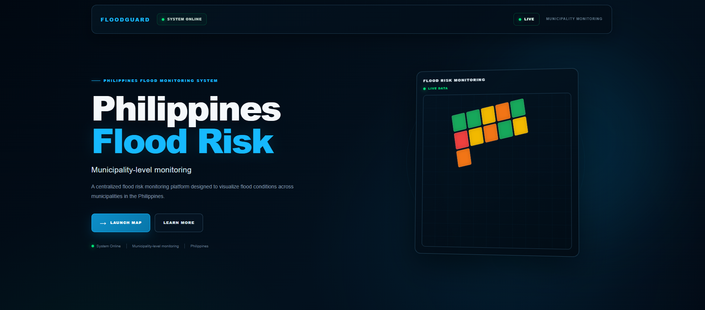
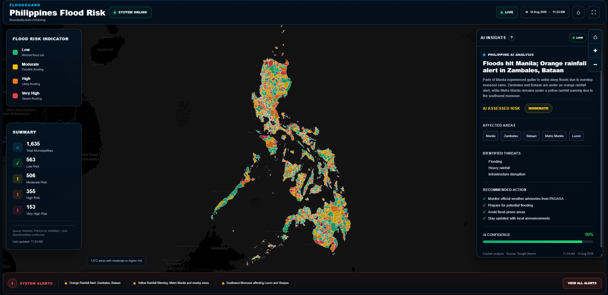
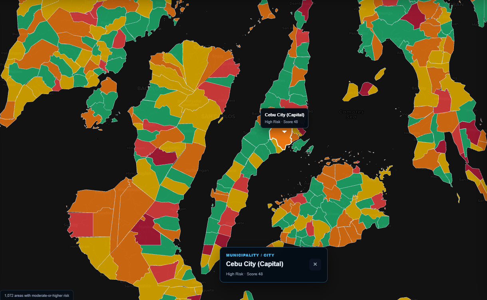

# FloodGuard

## Philippines Flood Risk Monitoring System

FloodGuard is a web-based flood risk monitoring platform designed to visualize municipality-level flood risk across the Philippines through an interactive map and monitoring dashboard.

The system provides color-coded flood risk indicators, municipality information, risk summaries, system alerts, and an AI-assisted insights interface to support flood-risk visualization and situational awareness.

---

## Overview

FloodGuard provides a centralized interface for viewing and interpreting municipality-level flood risk information.

The platform consists of the following primary components:

- Interactive Philippines flood risk map
- Municipality-level visualization
- Flood risk classification
- Risk summary
- Municipality identification
- Map navigation and controls
- AI-assisted insights
- System alerts
- Monitoring dashboard
- Landing page

---

## Flood Risk Classification

FloodGuard uses five flood risk classifications:

| Risk Level | Description |
|------------|-------------|
| Low | Minimal flood risk |
| Moderate | Possible flooding |
| High | Likely flooding |
| Very High | Severe flooding |
| Critical | Extreme flood risk |

The classifications are represented on the map using distinct colors to allow users to identify areas with different levels of flood risk.

---

## Interactive Map

The FloodGuard monitoring dashboard provides an interactive map displaying Philippine municipalities.

### Map Features

- Philippine municipality boundaries
- Municipality-level visualization
- Clickable municipalities
- Municipality name identification
- Color-coded flood risk indicators
- Zoom in and zoom out controls
- Map reset control
- Interactive map navigation

---

## Risk Summary

The dashboard includes a risk summary panel that provides an overview of municipality-level flood risk.

The summary can display:

- Total municipalities
- Low-risk municipalities
- Moderate-risk municipalities
- High-risk municipalities
- Very-high-risk municipalities

This provides users with a quick overview of the distribution of flood-risk classifications.

---

## AI-Assisted Insights

FloodGuard includes an AI-assisted insights panel designed to organize and present situational information related to flood and weather conditions.

The panel may include:

- Situational analysis
- Assessed risk level
- Affected areas
- Identified threats
- Recommended actions
- AI confidence
- Analysis source information

AI-generated information is intended to support situational awareness and should not be considered an official emergency warning. Important information should be verified through appropriate government agencies and local authorities.

---

## System Alerts

The monitoring dashboard includes a system alert bar for displaying important system and monitoring information.

Examples include:

- Rainfall alerts
- Flood monitoring status
- Municipality-level risk visualization status
- AI-assisted analysis availability
- System operational status

---

## Landing Page

FloodGuard includes a dedicated landing page that introduces the monitoring platform and provides access to the interactive map.

The landing page includes:

- FloodGuard branding
- Philippines Flood Risk title
- Municipality-level monitoring description
- System status
- Flood risk visualization preview
- Platform features
- Project information
- Launch Map functionality

---

## Screenshots

### FloodGuard Landing Page

The FloodGuard landing page introduces the platform and provides access to the municipality-level flood risk monitoring dashboard.



---

### Philippines Flood Risk Monitoring Dashboard

The main monitoring dashboard displays municipality-level flood risk across the Philippines using color-coded indicators, risk summaries, AI-assisted insights, map controls, and system alerts.



---

### Municipality-Level Monitoring

Users can zoom into the map and select individual municipalities to view the municipality name and corresponding flood-risk information.



---

## Technology Stack

### Frontend

- Next.js
- React
- TypeScript
- CSS

### Mapping

- Leaflet
- GeoJSON

### Development

- Node.js
- npm
- Git
- GitHub
- Visual Studio Code

### Deployment

- Vercel

---

## Project Structure

```text
FloodGuard-Aklan/
│
├── app/
│   ├── api/
│   ├── map/
│   │   └── page.tsx
│   ├── page.tsx
│   ├── globals.css
│   └── layout.tsx
│
├── components/
│   └── map/
│       ├── FloodMapClient.tsx
│       └── FloodMap.css
│
├── hooks/
│
├── lib/
│   └── philippines/
│
├── public/
│   ├── data/
│   ├── geojson/
│   ├── icons/
│   ├── images/
│   └── logos/
│
├── scripts/
├── services/
├── types/
├── utils/
│
├── next.config.ts
├── package.json
├── package-lock.json
├── postcss.config.mjs
├── eslint.config.mjs
├── tsconfig.json
└── README.md